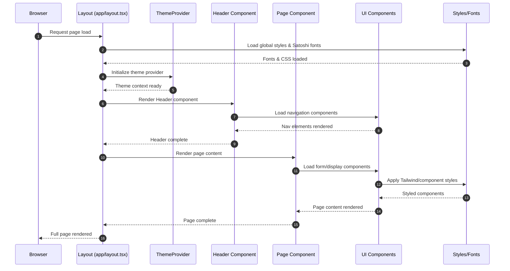
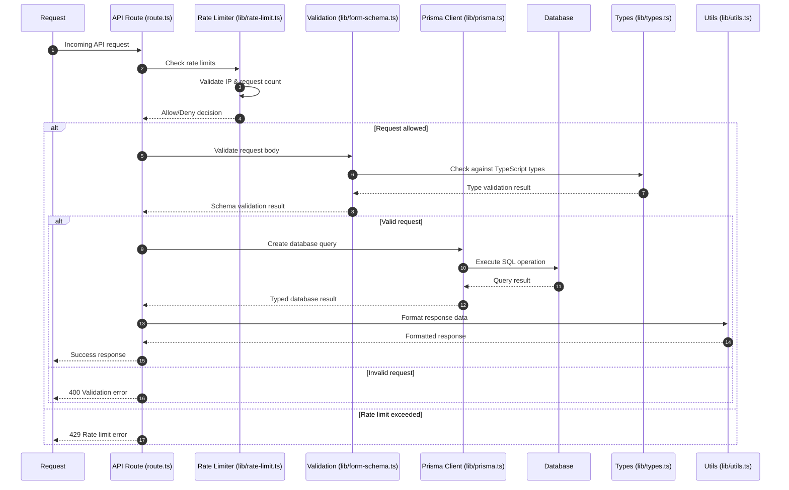
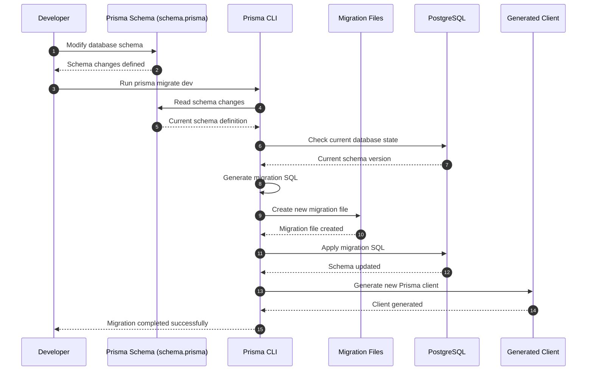
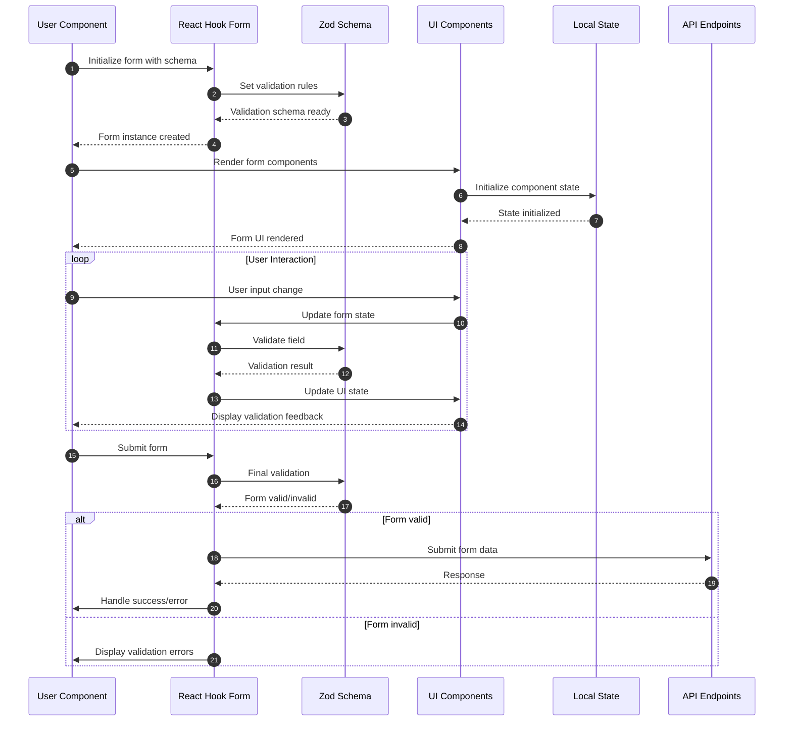
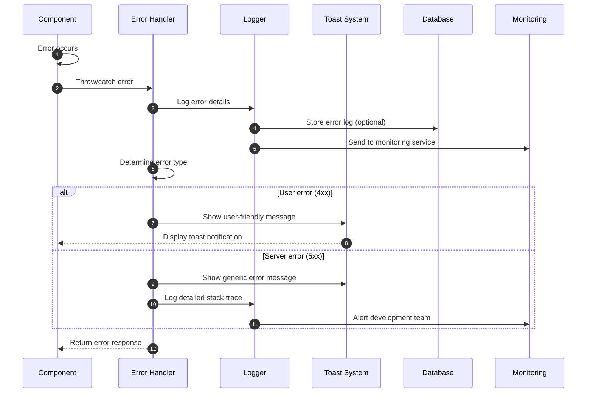

# 📁 Files Documentation - Water Treatment System

This document provides a comprehensive overview of all files and directories in
the Water Treatment System project, explaining their purpose, functionality, and
relationships.

## 🏗️ Project Structure Overview

```
Water-Treatment/
├── 📦 Configuration Files
├── 🎨 Frontend (Next.js App)
├── 🔌 API Routes
├── 🎯 Components
├── 📚 Libraries & Utils
├── 🗄️ Database (Prisma)
├── 🖼️ Static Assets
├── 🎨 Styles
└── 🔧 Scripts
```

---

## 📦 Root Configuration Files

### `package.json`

**Purpose**: Project dependencies and scripts configuration

- **Dependencies**: React, Next.js, Prisma, Klaviyo API, UI libraries
- **Scripts**: Build, dev, lint, seed database, format code
- **Dev Dependencies**: TypeScript, Prettier, Husky for git hooks

### `next.config.mjs`

**Purpose**: Next.js configuration

- Configures build settings, API routes, and optimization options

### `tsconfig.json`

**Purpose**: TypeScript configuration

- Defines compilation options, path mapping, and type checking rules

### `tailwind.config.ts`

**Purpose**: Tailwind CSS configuration

- Custom theme colors, typography, animations, and component styling

### `postcss.config.mjs`

**Purpose**: PostCSS configuration

- Processes CSS with Tailwind CSS and Autoprefixer

### `components.json`

**Purpose**: Shadcn/ui component configuration

- Defines component library settings and styling preferences

### `docker-compose.yaml`

**Purpose**: Docker container orchestration

- PostgreSQL database container configuration
- Development environment setup

### Lock Files

- `bun.lock` - Bun package manager lock file
- `pnpm-lock.yaml` - PNPM alternative lock file
- Ensures consistent dependency versions across environments

---

## 🎨 Frontend Application (`app/` directory)

### App Router Structure (Next.js 13+ App Directory)

#### Root Layout Files

- **`app/layout.tsx`**: Global application layout wrapper
- **`app/globals.css`**: Global CSS styles and Tailwind imports
- **`app/favicon.ico`**: Application favicon
- **`app/opengraph-image.png`**: Social media preview image

#### Home Page Group `app/(home)/`

- **`layout.tsx`**: Home page group layout
- **`page.tsx`**: Main landing page with water quality form
  - Form for zip code, email, phone number input
  - Water system selection dropdown
  - Client-side validation with Zod schemas
  - Form submission handling

#### Admin Panel `app/admin/`

- **`page.tsx`**: Admin login page
  - Secure authentication form
  - Admin credential validation
  - JWT token management
- **`dashboard/page.tsx`**: Admin dashboard
  - Lead management interface
  - Analytics and statistics
  - Report generation monitoring

#### Report Display `app/report/`

- **`page.tsx`**: Water quality report viewer
  - Detailed contamination analysis
  - Health risk information
  - Filter recommendations
  - Downloadable report format

---

## 🔌 API Routes (`app/api/` directory)

### Form Processing `app/api/form/`

- **`route.ts`**: Form submission endpoint
  - Validates user input (email, phone, zip code)
  - Creates/updates Klaviyo profiles
  - Stores lead data in database
  - Returns available water systems

### Report Generation `app/api/report/`

- **`route.ts`**: Water quality report endpoint
  - Fetches contamination data by PWSID
  - Processes contaminant information
  - Generates structured reports
  - Caches results for performance
  - Sends events to Klaviyo

### Admin Authentication `app/api/admin/`

- **`route.ts`**: Admin login endpoint
  - Validates admin credentials
  - Issues JWT tokens
  - Rate limiting protection

---

## 🎯 Components (`components/` directory)

### Layout Components

- **`Header.tsx`**: Navigation header with logo and menu
- **`Footer.tsx`**: Site footer with links and contact info
- **`CTA.tsx`**: Call-to-action component for marketing

### Utility Components

- **`Loading.tsx`**: Loading spinner component
- **`Suspense.tsx`**: Suspense fallback components
- **`mode-toggle.tsx`**: Dark/light theme toggle
- **`theme-provider.tsx`**: Theme context provider

### UI Components (`components/ui/`)

Built with Radix UI primitives and styled with Tailwind CSS:

#### Form Components

- **`button.tsx`**: Button variants (default, destructive, outline, etc.)
- **`input.tsx`**: Text input with validation states
- **`label.tsx`**: Form labels with accessibility
- **`textarea.tsx`**: Multi-line text input
- **`select.tsx`**: Dropdown selection component
- **`checkbox.tsx`**: Checkbox input with states
- **`radio-group.tsx`**: Radio button groups
- **`switch.tsx`**: Toggle switch component
- **`form.tsx`**: Form wrapper with react-hook-form integration

#### Layout Components

- **`card.tsx`**: Card container with header, content, footer
- **`separator.tsx`**: Visual dividers
- **`aspect-ratio.tsx`**: Responsive aspect ratio containers
- **`scroll-area.tsx`**: Custom scrollable areas
- **`resizable.tsx`**: Resizable panel layouts

#### Navigation Components

- **`navigation-menu.tsx`**: Main navigation menu
- **`breadcrumb.tsx`**: Breadcrumb navigation
- **`pagination.tsx`**: Page navigation controls
- **`tabs.tsx`**: Tabbed interface component
- **`sidebar.tsx`**: Collapsible sidebar navigation

#### Feedback Components

- **`alert.tsx`**: Alert messages (info, warning, error)
- **`alert-dialog.tsx`**: Modal confirmation dialogs
- **`toast.tsx`**: Toast notification system
- **`toaster.tsx`**: Toast container and provider
- **`sonner.tsx`**: Advanced toast notifications
- **`progress.tsx`**: Progress bars and indicators
- **`skeleton.tsx`**: Loading skeleton components

#### Interactive Components

- **`dialog.tsx`**: Modal dialogs
- **`drawer.tsx`**: Slide-out drawers
- **`dropdown-menu.tsx`**: Context menus
- **`hover-card.tsx`**: Hover-triggered cards
- **`popover.tsx`**: Floating popovers
- **`tooltip.tsx`**: Hover tooltips
- **`command.tsx`**: Command palette interface
- **`context-menu.tsx`**: Right-click context menus

#### Data Display Components

- **`table.tsx`**: Data tables with sorting
- **`badge.tsx`**: Status badges and tags
- **`avatar.tsx`**: User avatar component
- **`calendar.tsx`**: Date picker calendar
- **`chart.tsx`**: Chart visualization wrapper
- **`carousel.tsx`**: Image/content carousel

#### Advanced Components

- **`accordion.tsx`**: Collapsible content sections
- **`collapsible.tsx`**: Show/hide content areas
- **`toggle.tsx`**: Toggle buttons
- **`toggle-group.tsx`**: Grouped toggle buttons
- **`slider.tsx`**: Range slider inputs
- **`menubar.tsx`**: Application menu bar
- **`input-otp.tsx`**: One-time password input

#### Hooks and Utilities

- **`use-mobile.tsx`**: Mobile device detection hook
- **`use-toast.ts`**: Toast notification management

---

## 📚 Libraries & Utilities (`lib/` directory)

### Core Libraries

- **`index.ts`**: Central exports for all library functions
- **`utils.ts`**: Utility functions (className merging, formatters)
- **`prisma.ts`**: Prisma client instance and database connection

### Data Management

- **`contaminants.ts`**: Comprehensive contaminant database (19,000+ lines)
  - Contaminant names, categories, health effects
  - Sources, detection rates, regulatory limits
  - Chemical analysis data (CAS numbers, units)
- **`mockdata.ts`**: Mock data for development and testing

### Configuration

- **`constants.ts`**: Application constants and configuration values
- **`types.ts`**: TypeScript type definitions and interfaces

### Form Handling

- **`form-schema.ts`**: Zod validation schemas
  - Email validation
  - ZIP code validation (US format)
  - Phone number validation
  - Water system interface definitions

### Security & Performance

- **`rate-limit.ts`**: API rate limiting implementation
  - Prevents abuse and spam
  - Configurable limits per endpoint
  - Redis-based tracking (if configured)

---

## 🗄️ Database (`prisma/` directory)

### Schema Definition

- **`schema.prisma`**: Database schema definition
  - **leads table**: User information and contact details
  - **contaminant_mapping table**: Water system contamination data
  - **contaminant table**: Contaminant reference database
  - Relationships and indexes

### Migrations (`prisma/migrations/`)

- **`migration_lock.toml`**: Migration provider lock file
- **`20250813144237_init/`**: Initial database schema
- **`20250821054943_contaminants/`**: Contaminants table creation
- **`20250821055038_contaminants/`**: Contaminants table updates
- **`20250821162510_add_timestamps/`**: Timestamp fields addition

---

## 🖼️ Static Assets (`public/` directory)

### Brand Assets

- **`logo.webp`**: Main application logo
- **`placeholder-logo.png`**: Fallback logo image
- **`placeholder-logo.svg`**: Vector logo format

### User Interface Images

- **`placeholder-user.jpg`**: Default user avatar
- **`placeholder.jpg`**: General placeholder image
- **`placeholder.svg`**: Vector placeholder
- **`usaflag.png`**: US flag icon for forms

### Call-to-Action Images (`public/cta/`)

- **`image1.webp` through `image6.webp`**: Marketing carousel images
- **`waterimage.webp`**: Hero section water imagery

---

## 🎨 Styles (`styles/` directory)

### CSS Files (`styles/css/`)

- **`satoshi.css`**: Custom Satoshi font face definitions

### Font Files (`styles/fonts/`)

Complete Satoshi font family in multiple formats:

- **Regular weights**: Light, Regular, Medium, Bold, Black
- **Italic variants**: All weights in italic
- **Multiple formats**: EOT, TTF, WOFF, WOFF2 for browser compatibility
- **Examples**:
  - `Satoshi-Regular.woff2`
  - `Satoshi-Bold.ttf`
  - `Satoshi-LightItalic.eot`

---

## 🔧 Scripts (`script/` directory)

### Database Management

- **`seed-contaminants.ts`**: Database seeding script
  - Populates contaminant reference table
  - Imports comprehensive contaminant data
  - Handles data transformation and validation

---

## 🎯 Custom Hooks (`hooks/` directory)

### Utility Hooks

- **`use-mobile.tsx`**: Responsive design hook
  - Detects mobile screen sizes
  - Provides breakpoint-based logic
- **`use-toast.ts`**: Toast notification management
  - Centralized toast state
  - Multiple toast types and positions

---

## 🔄 File Interaction Sequence Diagrams

### Component Loading & Rendering Flow



### API Route Processing Flow



### Database Migration & Schema Flow



### Component State Management Flow



### Asset Loading & Optimization Flow

```mermaid
sequenceDiagram
  autonumber
  participant B as Browser
  participant NI as Next.js Image
  participant PF as Public Folder
  participant SF as Styles/Fonts
  participant TC as Tailwind CSS
  participant OPT as Optimization

  B->>NI: Request image component
  NI->>PF: Load image from public/
  PF-->>NI: Raw image file
  NI->>OPT: Apply Next.js optimizations
  OPT->>OPT: Resize, compress, format conversion
  OPT-->>NI: Optimized image
  NI-->>B: Serve optimized image

  B->>SF: Load custom fonts
  SF->>SF: Load Satoshi font variants
  SF-->>B: Font files served

  B->>TC: Request component styles
  TC->>TC: Process Tailwind classes
  TC->>SF: Apply custom CSS variables
  SF-->>TC: Merged styles
  TC-->>B: Compiled CSS
```

### Error Handling & Logging Flow



---

## 🛠️ Development Workflow Files

### Code Quality

- **`prettier.config.js`**: Code formatting rules
- **`.prettierrc`**: Prettier configuration
- **`.eslintrc.json`**: ESLint linting rules

### Git Management

- **`.gitignore`**: Ignored files and directories
- **`husky/`**: Git hooks for pre-commit validation
- **`lint-staged`**: Staged file linting

### Build Artifacts

- **`next-env.d.ts`**: Next.js TypeScript declarations
- **`tsconfig.tsbuildinfo`**: TypeScript incremental build cache
- **`result.json`**: Build or test results

---

## 🚀 Deployment Files

### Docker Configuration

- **`docker-compose.yaml`**: Multi-container application setup
- **`Dockerfile`**: Container build instructions (if present)

### Environment Configuration

- **`.env`**: Environment variables (not in repo)
- **`.env.example`**: Example environment configuration
- **`.env.local`**: Local development overrides

---

## 📊 File Size and Complexity Analysis

| Category          | Files     | Complexity | Purpose                             |
| ----------------- | --------- | ---------- | ----------------------------------- |
| **UI Components** | 40+ files | Medium     | Reusable interface elements         |
| **API Routes**    | 6 files   | High       | Business logic and data processing  |
| **Pages**         | 4 files   | Medium     | User interface and interactions     |
| **Database**      | 5 files   | High       | Data persistence and migrations     |
| **Utilities**     | 8 files   | Medium     | Helper functions and configurations |
| **Assets**        | 20+ files | Low        | Static content and branding         |

---

## 🔍 Key Integration Points

### 1. **Frontend ↔ Backend**

- API routes handle form submissions and data requests
- TypeScript interfaces ensure type safety across boundaries

### 2. **Database ↔ Application**

- Prisma ORM provides type-safe database operations
- Migrations handle schema evolution

### 3. **External Services**

- Klaviyo API for email marketing automation
- EPA data sources for water quality information

### 4. **Development ↔ Production**

- Docker containers for consistent environments
- Environment variables for configuration management

## 📊 Estimated Code Review Effort

🎯 **4 (Complex)** | ⏱️ **~75-90 minutes**

### File Complexity Analysis:

- **High Complexity (15-20 min each)**: API routes, database schema, form
  validation
- **Medium Complexity (10-15 min each)**: Page components, admin dashboard,
  utilities
- **Low Complexity (5-10 min each)**: UI components, static assets,
  configuration
- **Documentation (5 min each)**: README files, type definitions

### Review Focus Areas:

- **Security**: Admin authentication, rate limiting, input validation
- **Performance**: Database queries, API response times, asset optimization
- **Maintainability**: Code organization, type safety, error handling
- **Integration**: External API usage, database relationships, email automation

---

This comprehensive file documentation provides a complete understanding of the
Water Treatment System's architecture, making it easier for developers to
navigate, maintain, and extend the application efficiently.
